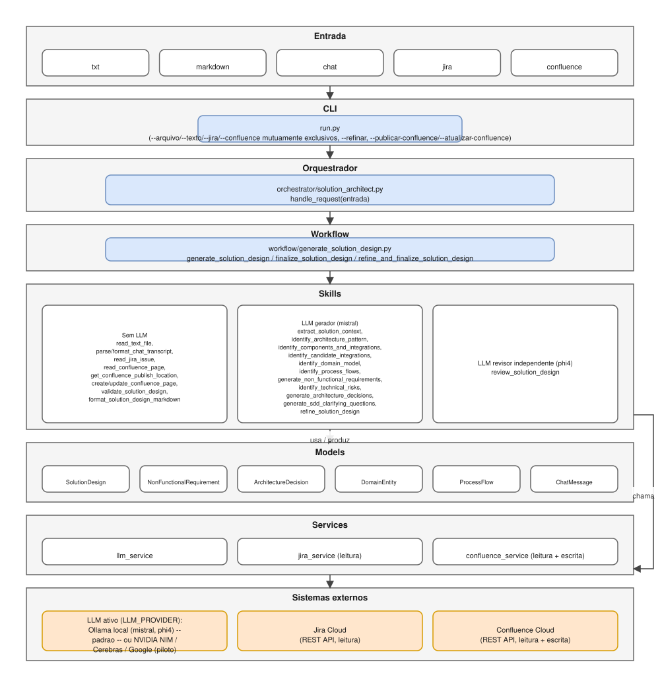
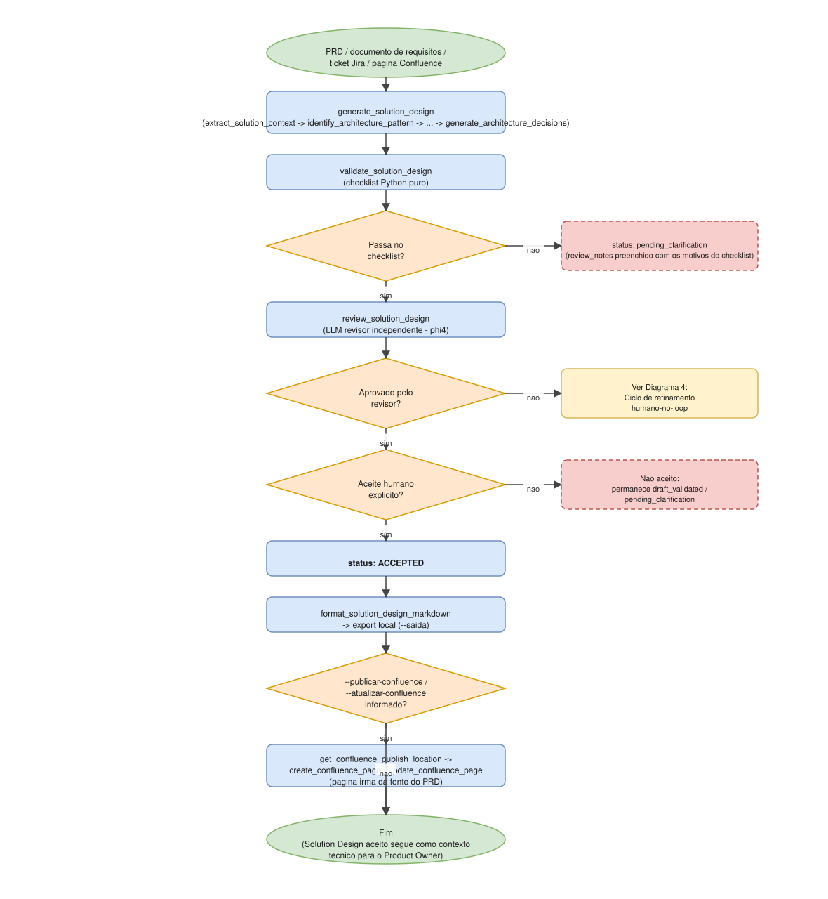
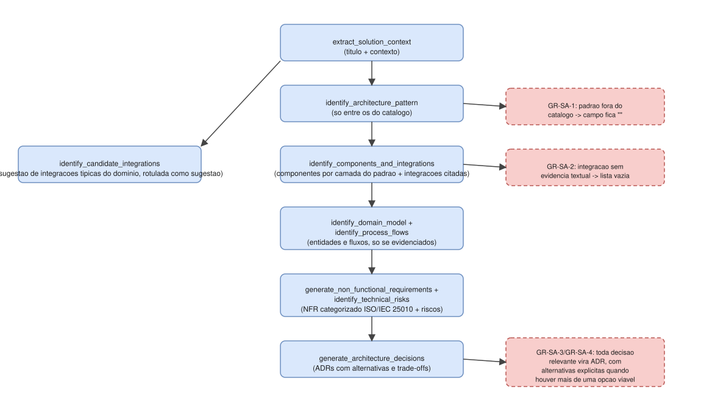
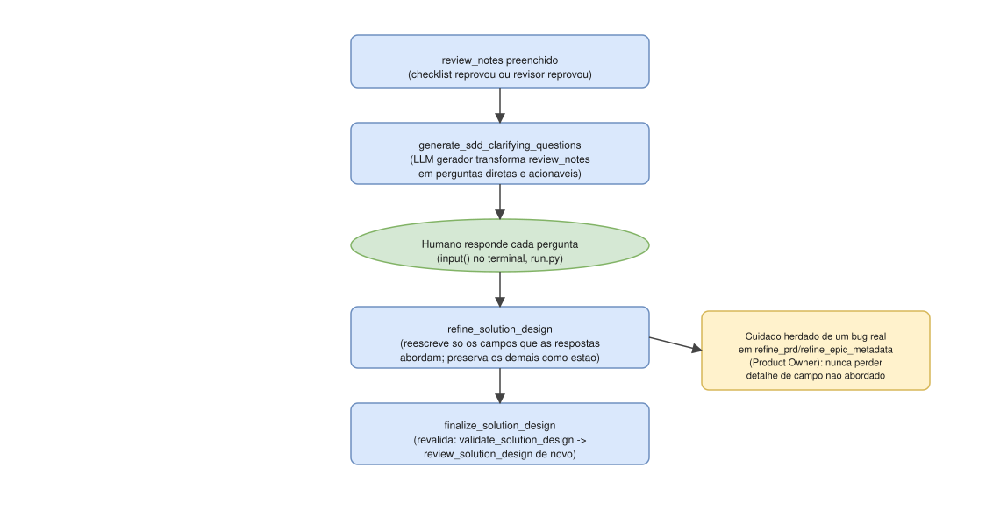
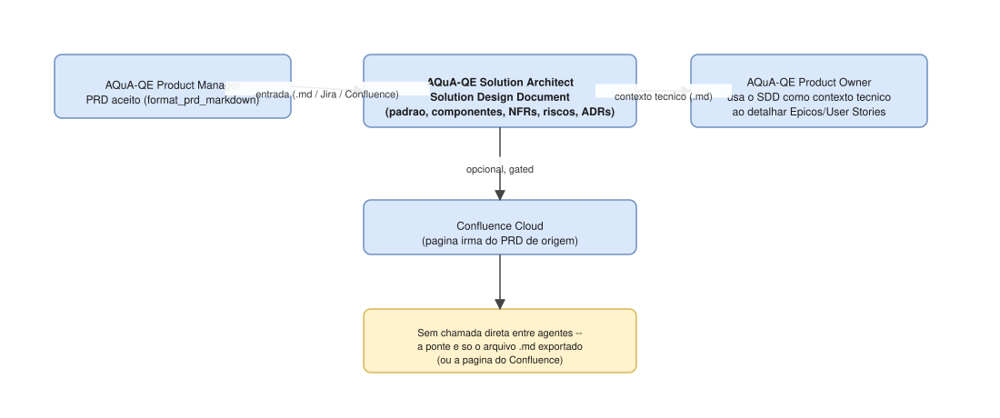

# Diagramas de arquitetura

Representação visual da arquitetura e dos fluxos do agente, complementando a documentação em prosa de `../agent/system_design.md`, `../agent/agent_design.md`, `../agent/skills.md` e `../../WHITEPAPER.md`.

- **Fonte editável**: [`architecture.drawio`](architecture.drawio) — arquivo único, 5 páginas, abra em [app.diagrams.net](https://app.diagrams.net) ou na extensão "Draw.io Integration" do VS Code.
- **Espelho estático**: `svg/*.svg` — mesmo conteúdo de cada página, visível diretamente aqui no GitHub/VS Code, sem precisar abrir o draw.io. Gerados por um conversor Python próprio (`.drawio` → SVG, interpretando containers/formas/arestas do mxGraph), não por exportação oficial do app draw.io — em caso de dúvida sobre fidelidade visual, o `.drawio` é a fonte de verdade; abra-o diretamente para conferir.

## 1 — Arquitetura em camadas

Da entrada (`.txt`/Markdown/chat/Jira/Confluence) até o provedor de LLM ativo (Ollama local por padrão; piloto opcional de NVIDIA NIM/Cerebras Inference/Google AI Studio via `LLM_PROVIDER`, ver `../agent/system_design.md`) e, para leitura e escrita, Jira/Confluence Cloud, passando por CLI, orquestrador, workflow, skills, models e services. Diferente de PM/PO, este agente tem um único workflow (`generate_solution_design.py`) — não há distinção "unitário/lote" nem múltiplos modos, porque só existe um artefato nesta fase (o Solution Design Document).

## 2 — Fluxo do Solution Design

`Generate → Validate → Review → [Refine] → Approve`, o mesmo pipeline de dois pontos de checagem (checklist automático e revisor independente) antes de qualquer aceite humano já usado em PM/PO — aqui aplicado a um único artefato. Detalhe textual em `../agent/system_design.md` e `../agent/acceptance_patterns.md`.

Depois de `Approve`, o Solution Design formatado (`format_solution_design_markdown`) pode opcionalmente ser publicado como página nova (`create_confluence_page`, `--publicar-confluence`) ou usado para atualizar uma página já existente (`update_confluence_page`, `--atualizar-confluence`, mutuamente exclusivo) — sempre como página **irmã** da página de origem do PRD (`get_confluence_publish_location`), sob uma segunda confirmação humana explícita, distinta do aceite.

## 3 — Elaboração sequencial do Solution Design

A sequência de skills que produz o conteúdo técnico do Solution Design, na ordem fixa do `agent_manifest.yaml`: `identify_architecture_pattern` (só entre os padrões do catálogo, GR-SA-1) alimenta `identify_components_and_integrations` (componentes por camada do padrão escolhido + integrações citadas/inferíveis, GR-SA-2), que por sua vez alimenta `generate_architecture_decisions` (ADRs com alternativas explícitas quando houver mais de uma opção viável, GR-SA-3/GR-SA-4). Em paralelo, `identify_candidate_integrations` sugere integrações típicas do domínio (sempre rotuladas como sugestão, distinta de `identify_components_and_integrations`), e `identify_domain_model`/`identify_process_flows` extraem entidades e fluxos de processo quando evidenciados no texto. `generate_non_functional_requirements` (categorizado ISO/IEC 25010, com `rationale` rastreável, GR-SA-6) e `identify_technical_risks` (GR-SA-7, nunca omite um risco identificável) fecham o conjunto antes dos ADRs. Detalhe completo em `../agent/skills.md`.

## 4 — Ciclo de refinamento humano-no-loop

Mesmo padrão de PM/PO: quando o checklist ou o revisor reprovam, o agente gera perguntas objetivas (`generate_sdd_clarifying_questions`) para um humano responder — não tenta se autocorrigir sozinho. `refine_solution_design` preserva o detalhe dos campos que as respostas não abordam, um cuidado incorporado desde o início deste agente, aprendido com um bug real já corrigido em `refine_prd`/`refine_epic_metadata` no AQuA-QE Product Owner. Ver seção 6 do `../../WHITEPAPER.md`.

## 5 — Pipeline completo e handoff (Product Manager → Solution Architect → Product Owner)

Este agente consome o PRD já aceito do AQuA-QE Product Manager (arquivo, Jira ou Confluence) e produz o Solution Design Document, que o AQuA-QE Product Owner usa como **contexto técnico** ao detalhar Épicos/User Stories — a direção inversa de PM→PO usada em outros diagramas. A ponte entre os três agentes é sempre só o artefato exportado (arquivo `.md` ou página Confluence) — nenhuma chamada direta entre eles, nenhuma mudança de código do lado de PM ou PO. Ver seção 7 do `../../WHITEPAPER.md`.
